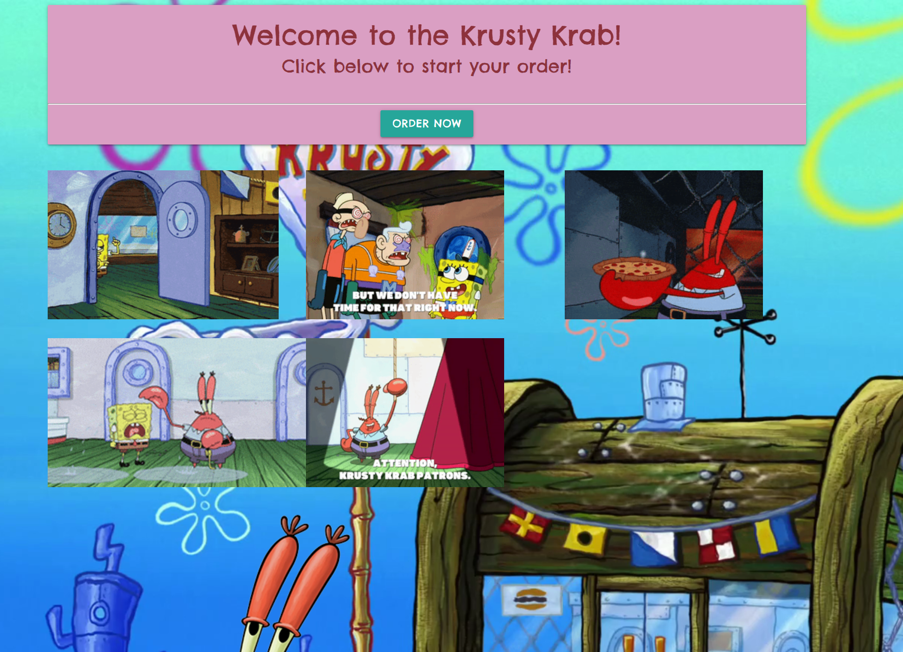
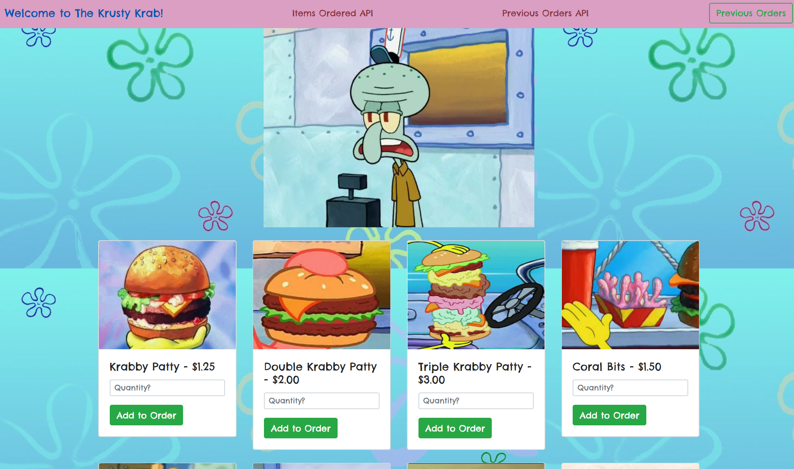
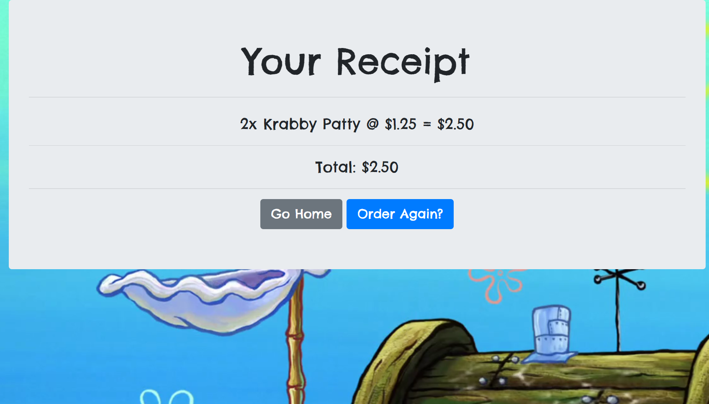

# The Krusty Krab

## Welcome all Spongebob Squarepants fans! Here at the Krusty Krab we have all of the fan favorites!!

* StoreFront (Krusty Krab) 
* HTML and UX (Materialize, Bootstrap)
* Node and Express Server (Set Up Connection)
* MYSQL Server and Database (Merch from Actual Show)
* File for API Documentation

## Routing
* Routes
    - GET 
        * Return DB on UI and console (SELECT * FROM ) 
        * Receive Certain Categories of Item/Specific Item ()
        * Cart of items purchased

* API 
    - /api route that displays documentation (in form of a file) on how to use API (For Developers); 
    - API routes for all the routes above to return comments, inventory, etc to developers in form of JSON 

* Who is the Client? 
    - User 
    - Developer (This is who the API is for)

* config.json - configuration for sequelize and Heroku to connect to the database
* models folder - has all of the schemas for our tables, although we ended up not using Item_Types or Menu_Items
* api-routes - lays the groundwork for get & post requests made by the .js & .html files in the public folder:
* /api/orders - get - findAll from Orders table (db)
* /api/items - get - findAll from Items_Ordered table (db)
* /api/lastorder - get - findOne from Orders table sorted by customer_id (descending) to find the most recent order number (to set the orderNumber variable in table
* krustykrab.js). Had to make this call synchronous which is unfortunate since it detracts from the user experience (slightly slower load times)
* /api/orders - post - Adds a new entry to Orders table (db) whenever someone clicks checkout (customer id, order total, and time of order)
* /api/items - post - Adds a new entry to Items_Ordered for each item ordered after clicking checkout (item name, item price, item quantity, total item price)
* html-routes - sets up all of the URL routes for the site:
* / - homepage/welcome page
* /krustykrab - Menu/Order page
* /receipt - Receipt for whatever just got ordered after they checkout
* /orders - Shows all previous orders using the get request from /api/orders
* /* (anything not listed above) - 404 error page

## Public Folder
* html files - front end webpages, using bootstrap, jquery, moment, google fonts, and our own css/js files. Home page and menu page use giphy api(?)
* css files - styling
* krustykrab.js - Makes an object for each item ordered, also makes an object with just the order # and order total for the Orders table
* receipt.js - have to take another look at this, forget how it works lol
* orders.js - makes a call to the Orders table and converts the returned array into html cards
* server.js - sets up express, connects it to our routes, initializes the DB using sequelize

## Things to improve -
* Make all calls asynchronously for fastest possible load times
* Hide API key from public
* Make it so orders on the previous orders page show items ordered, as well
* Add "sales" to database, so that each time an item is bought it adds the item total (price * quantity) to a sales column and we can track total sales for each item on the menu. The Menu_Items table could become useful for this(?)

## Contributors - 
* Isimemen Inegbedion - Front-End Design, Javascript, jQuery
* Colin Green - Sequelize, API/Routing creation, Javascript, jQuery
* Andrew Fowose - MySQL database creation
* Farangiz Asadulla - Routing creation